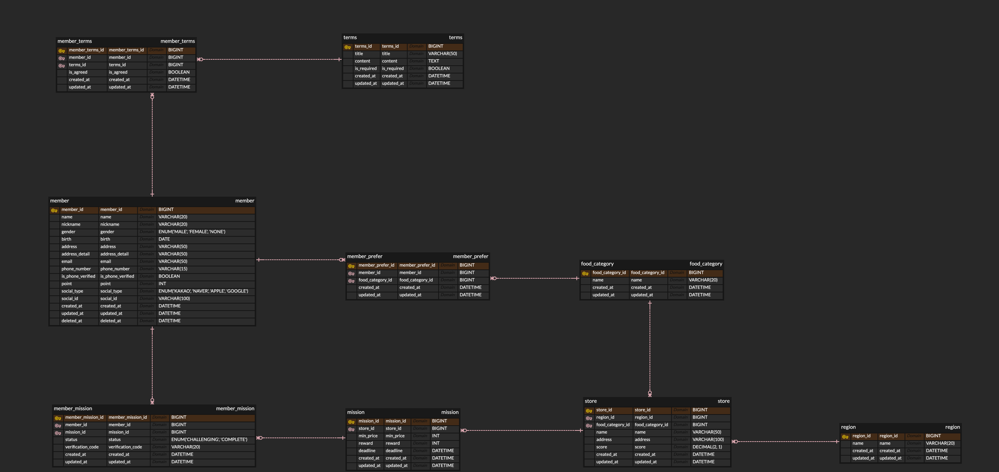

# 1주차 백엔드 - ERD 설계

지역별 가게를 방문하는 미션을 해결하고 포인트를 모으는 리워드 서비스의 ERD입니다. 설계 과정, 핵심 키워드, 트러블슈팅은 노션에 정리했습니다.

- 노션: https://app.notion.com/p/makeus-challenge/1-ERD-3dab57f4596b8009b235d8362eb36380
- 도구: ERDCloud (MySQL)

## 파일
- `erd.png`: ERD 사진
- `erd.sql`: ERDCloud에서 내보낸 MySQL DDL

## ERD

## 테이블
| 테이블 | 역할 |
| --- | --- |
| `member` | 회원 (소셜 로그인 정보, 포인트, 탈퇴 시각 포함) |
| `terms` | 약관 목록 |
| `member_terms` | 회원의 약관 동의 (매핑) |
| `food_category` | 음식 종류 |
| `member_prefer` | 회원의 선호 음식 (매핑) |
| `region` | 지역 |
| `store` | 가게 |
| `mission` | 가게가 낸 미션 |
| `member_mission` | 회원의 미션 수행 (매핑) |

## 설계 규칙
- 테이블과 칸 이름은 소문자 `snake_case`
- PK는 `테이블명_id`, BIGINT, AUTO_INCREMENT (ERDCloud 내보내기에는 AUTO_INCREMENT가 표시되지 않음)
- 1:N 관계는 모두 비식별 관계, N:M 관계는 매핑 테이블 3개로 분리
- 회원 탈퇴는 `member.deleted_at`을 기록하는 Soft Delete
